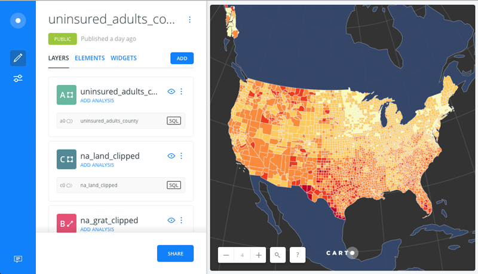
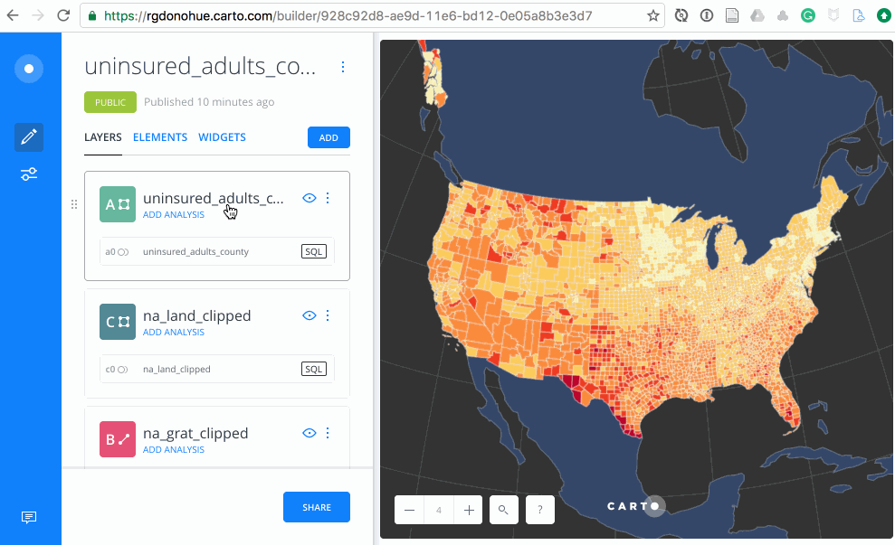
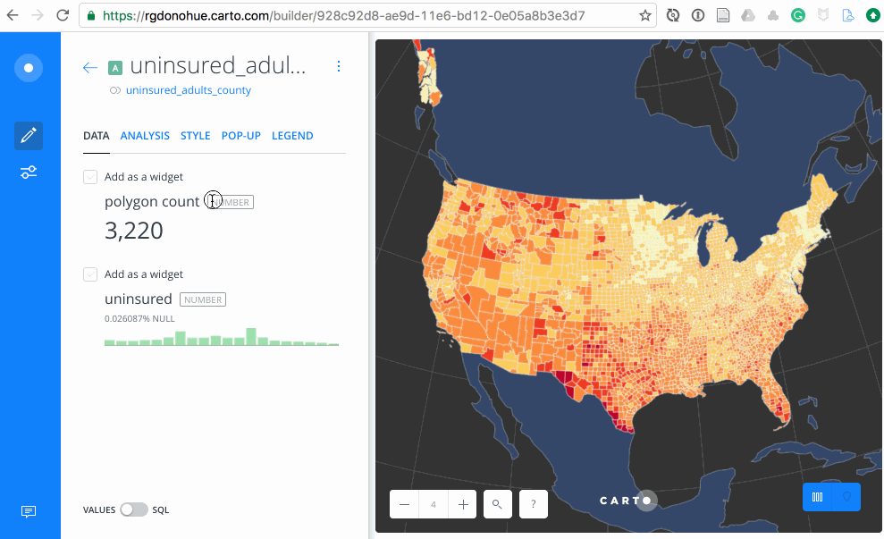
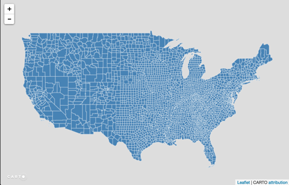
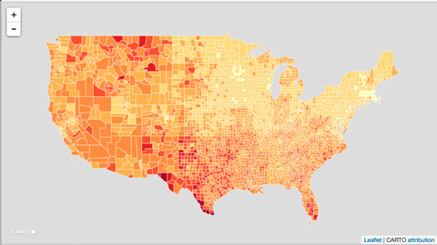
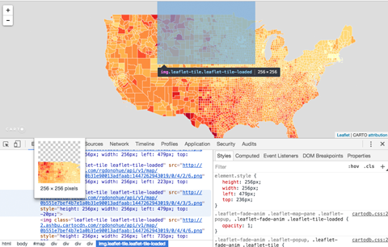
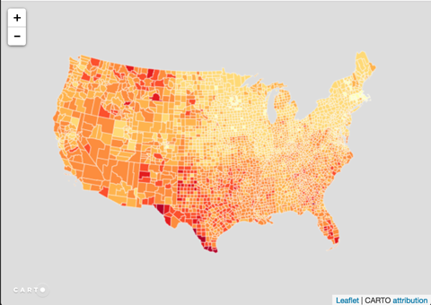
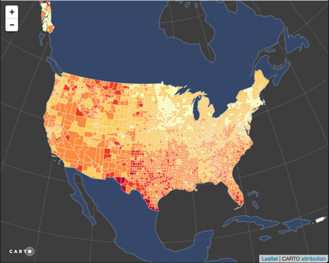

# Lesson 07: Extending CARTO and BUILDER with CARTO.js

This lesson explores the JavaScript library supporting the CARTO platform, [Carto.js](https://carto.com/docs/carto-engine/carto-js/), which expands the potential of CARTO's web editor for creating customized web maps. The lesson introduces the [API documentation](https://carto.com/docs/carto-engine/carto-js/api-methods/) and demonstrates various techniques for requesting data from a personal account on CARTO to render a map in the browser.

## Introduction to CARTO

Like [Mapbox](https://www.mapbox.com/), CARTO is an emerging company seizing recent advancements in open source web standards. Their state-of-the-art geospatial tools allowing us to better capture, store, analyze, represent, and share geographic information in the form of maps. Recently they have launched a new version of their Editor platform called [BUILDER](https://carto.com/builder/), which is powered by a "location intelligence" API called [ENGINE](https://carto.com/engine/).

CARTO's growing body of documentation, tutorials, and examples is excellent, and you should take some time to peruse these resources. A good point of entry is [Getting Started with CARTO](https://carto.com/docs/carto-engine/carto-js/getting-started/). Their [Map Academy](http://academy.carto.com/) offers great tutorials ranging from beginning to more advanced. The [CARTO codebase is also hosted on GitHub](https://github.com/CartoDB), and you can view the code in many [examples](https://github.com/CartoDB/cartodb.js/tree/develop/examples).

You may also wish to [follow CARTO on Twitter](https://twitter.com/CARTO), where they often announce free webinars you can access online. Finally, another good resource for fun examples using CARTO are the small Gist examples written by one of CARTO's main JavaScript developers, Javier Santana. These can be viewed as "Blocks": [javi santana’s Blocks](http://bl.ocks.org/javisantana).


**WARNING**: CARTO's web services and API is rapidly changing. Expect problems and incomplete documentation. This is the nature of 'cutting edge' web technologies.

This lesson will walk us through several example scripts to get a sense of how CARTO.js works. Our learning goals with this lesson is not mastery of the tool, but a basic familiarity with the API and a sense of the possibilities for moving forward. Let's start with a basic template to get us going (provided within your *lesson-07-data/* directory).

## Getting started with CARTO.js

To make use of the CARTO.js methods explored within this lesson, you'll first need a dataset hosted on CARTO through your account. For my examples I've uploaded the three GeoJSON files included within the *lesson-04-data/* directory into CARTO: *na_grat_clipped.geojson*, *na_land_clipped.geojson*, *uninsured_adults_county.geojson*. Feel free to upload these files and explore using BUILDER's interface on your own to recreate a similar map. You can also drag and drop the *uninsured_adults_county_map.carto* file into your CARTO interface and it will load the datasets and map into your account.

These data are based off of uninsured US adults by county for the year 2015, created for examples used in [Module 08 of MAP671](http://newmapsplus.uky.edu/map671-module-08-integrating-qgis-cartodb).

Within CARTO BUILDER, I can assemble a web map with these data layers, styled and reprojected to look like this:

  
**Figure 01**. CARTO hosted map of uninsured US adults by county for the year 2015.

Note that the map consists of three layers atop a dark grey base layer, and does not use a tiled base map. The bottom layer is a 20 degree graticule, and above that is a polygon of the N. American landmass (both clipped and generated as GeoJSON files from QGIS). The US counties layer sit atop those. Again, these are all ordered and styled using CartoCSS within the BUILDER web editor.

Like the CartoDB Editor, within BUILDER we can style and edit the styles for the look and feel of the vector geometries. The style rules are generated automatically by BUILDER using one of the available classification methods (quantile, equal interval, jenks). We = use the interface to style elements and our map, but also for accessing the CartoCSS rules for cutting and pasting into our script (see below):

  
**Figure 02**. Accessing CartoCSS rules in BUILDER.

Also noteworthy is that this map has been projected to a Albers Equal Area projection using the powerful PostGIS functionality provided by CARTO. Using a custom SQL query, we are able to transform the default coordinates of theses layers from the webmercator projection into others. Currently this query must be written by hand, but BUILDER will likely soon provide a user interface for this as well.

Like the CartoCSS, we can access the SQL queries powering the applicaiton through the BUILDER inteface.

  
**Figure 03**. Accessing SQL the query in BUILDER.

For this lesson we're going to explore how to build a similar map using JavaScript and CARTO's SQL API.

## Starting with a CARTO template

We'll want to first explore the [CARTO.js library and documentation](http://docs.carto.com/carto-engine/carto-js/).

Begin by opening the *index.html* file within the *lesson-06-data/* directory. The basic structure of this document should look familiar to you.

```html
<!DOCTYPE html>
<html>

<head>
    <title>673 Module 07 Carto Starter Template</title>
    <meta name="viewport" content="initial-scale=1.0, user-scalable=no" />
    <meta http-equiv="content-type" content="text/html; charset=UTF-8" />

    <link rel="stylesheet" href="https://cartodb-libs.global.ssl.fastly.net/cartodb.js/v3/3.15/themes/css/cartodb.css" />

    <style>
        html,
        body,
        #map {
            height: 100%;
            padding: 0;
            margin: 0;
        }
    </style>
</head>

<body>

    <div id="map"></div>

    <script src="https://cartodb-libs.global.ssl.fastly.net/cartodb.js/v3/3.15/cartodb.js"></script>
    <script>

        // your JS here


    </script>
</body>

</html>
```  
**Code Bank 01**. Starter Template for CARTO map.

Within the head of the document there is a link loading a *carto.css* CSS style sheet from CARTO's CDN. We can write our custom style rules between the `<style></style>` tags that follow, as usual.

Within the `<body></body>` tags we see the familiar `<div id="map"></div>`, the HTML element in which we will load our map.

We often see our JavaScript libraries loaded within the head of the document as well. However, it's not a bad practice to load these toward the bottom of the document, directly above where we write our own custom JavaScript between the `<script></script>` tags.

Within this template we see the request for the `carto.js` library:

```javascript
<script src="https://cartodb-libs.global.ssl.fastly.net/cartodb.js/v3/3.15/cartodb.js"></script>
```

Note that both the CARTO CSS and JS files are being loaded from a server supporting the more secure HTTPS protocol, required now when hosting files on GitHub Pages (and increasingly a best practice for requesting/sending any file over the web).


The Carto.js library comes conveniently bundled with the Leaflet JavaScript library, as well as JQuery.js, so no need to load those resources separately. However, as of this writing the the version of Leaflet included is the older Leaflet version 0.7.3 (boooooooo!). Carto.js v4 is due for release soon, so stay tuned!

Load this template file in your browser (i.e., open in Chrome using Brackets' Live Preview) and ensure there are no errors in the console before continuing.


## Using the CARTO createLayer method and a source object

Making web maps client-side with JavaScript using carto.js is not drastically different than using Leaflet.js. The key is understanding how to use the[`createLayer()` method](http://docs.carto.com/carto-engine/carto-js/api-methods/#cartocreatelayer) and a [source object](https://carto.com/docs/carto-engine/carto-js/layer-source-object/).

We first create an object (and assign it to a variable) using the following structure. We then pass this object to the `createLayer()` method. Carto.js will make a request to the server to process this information and return the appropriate map tiles. This is the basic template structure:

```javascript
var map = L.map('map', {
    center: // map center
    zoom: // initial zoom level
});

var sourceObject = {
    user_name: // string of your CARTO user name,
    type: 'cartodb',
    sublayers: [
        {
            sql: "< sql statement selecting from CARTO table >",
            cartocss: // string of CartoCSS rules for styling the layer
        }  
    ]
}

cartodb.createLayer(map, sourceObject).addTo(map);
```  
**Code Bank 02**. Structure of the source object.

We need to edit this structure with three pieces of information: 1.) your username, 2.) the CartoCSS rules, and 3.) a SQL query statement to request the necessary information using [CARTO's SQL API](https://carto.com/docs/carto-engine/sql-api/).

You can handle your username, but let's think about how we write the second two. First, we need an SQL statement to select all (or some) of the features from a particular data table hosted on CARTO. In the most simple sense, we just want to select all the features from our uninsured data table hosted on CARTO. We can do this with the following statement:

```sql
SELECT * FROM uninsured_adults_county
```

Again, the useful thing about creating the web map in BUILDER  (at least partially) is that we can use it as an intermediary between the web interface and our code to copy/paste CartoCSS rules and SQL statements. If we are unsure of the name of our data table, we can look in BUILDER to see how it's doing it (see Figure 03).

Insert this statement into the template for the `sublayers`'s property `sql` value. However, beyond requesting the data using the query, we also need to specify the CartoCSS rules for this sublayer for the map to display.

Since the CartoCSS rule is a long, complicated string, we find ways to store it and use more easily. One way is to first a long, concatenated string of the rules to a variable within the JavaScript. So for instance, for styling these features I may write:

```css
var cartoCSS = "#layer {" +
  "polygon-fill: steelblue;" +
  "line-width: 1;" +
  "line-color: #FFF;" +
  "line-opacity: 0.5;" +
"}";
```

This is a difficult and obnoxious string to write correctly, with the quotation marks and + signs at each end. Below we'll explore an easier way. But for now, update your document with the changes. It should look like this (using your username of course):

```javascript
var map = L.map('map', {
    center: [40,-104],
    zoom: 4
});

var cartoCSS = "#layer {" +
  "polygon-fill: steelblue" +
  "line-width: 1;" +
  "line-color: #FFF;" +
  "line-opacity: 0.5;" +
"}";


var sourceObject = {
    user_name: 'rgdonohue',
    type: 'cartodb',
    sublayers: [
        {
            sql: "SELECT * FROM uninsured_adults_county",
            cartocss: cartoCSS
        }
    ]
}

cartodb.createLayer(map, sourceObject).addTo(map);
```  
**Code Bank 03**. Applying CartoCSS rules to the source object with a variable.

Saving these changes and refreshing the local rendering in our browser will display our geometries, given no errors.

  
**Figure 04**. Map rendered using a source object and CartoCSS rules.

Of course, we don't want to color these polygons simply using 'steeblue', but instead want to color them based upon some classification breaks.

CARTO makes styling our thematic map easier with a `ramp` function we can use within the CartoCSS. Try replacing the `steelblue` with this code (again, generated within BUILDER):

```css
ramp([uninsured], (#ffffb2, #fed976, #feb24c, #fd8d3c, #fc4e2a, #e31a1c, #b10026), jenks)
```

This ramp function takes three arguments: the attribute (column name) to which we wish to apply the quantification classification, a series of color values for our anticipated choropleth map, and either `quantile`, `equal interval`, or `jenks`. You can enter any number of color values you'd like, and the given classification method will take the full data range and apply those colors to the specific values (pretty neat, no?).

  
**Figure 05**. Thematic map generated using the ramp function in CartoCSS.

Important to note is that, although it looks very similar to the SVG elements we've drawn with Leaflet, this map is very different in terms of how it is delivered and rendered in the browser. These are not SVG elements being drawn in the browser, but rather raster tile images assembled server-side by CARTO.

Using your inspect elements tool in the web developer tool bar, you can see how these are in fact raster images. We're using CARTO to create a 'slippy map'!

  
**Figure 06**. Inspecting DOM image elements of the CARTO map.

Having the raster tile images delivered to our users' browsers has its tradeoffs. While we lose the ability to dynamically update these images, we can take advantage of CARTO's powerful PostGIS-enabled database hosting our data to do amazing things. We're not going bananas yet with this, but we'll at least re-project our geometry data into an equal area projection more appropriate for our choropleth map.

### Projecting geometries client-side with SQL queries and PostGIS

We can re-project our geometries using this client-side script by modifying the SQL statement. These SQL strings can also be stored as variables for legibility within our document (like we just did with our CartoCSS rules), but here we'll simply assign the string the the sql property.

This SQL query is using a PostGIS function, [ST_Transform](http://postgis.net/docs/ST_Transform.html) and using the [ESPG code 2163](https://epsg.io/2163), US National Atlas Equal Area. This function effectively changes the coordinates of our geometries from the default web mercator projection to this new one.

```javascript
sublayers: [
    {
        sql: "SELECT ST_Transform(the_geom, 2163) AS the_geom_webmercator, cartodb_id, uninsured FROM uninsured_adults_county",
        cartocss: cartoCSS
    }  
]
```  
**Code Bank 04**. Applying a SQL statement to request layer be reprojected from Web Mercator.

IMPORTANT: You'll also need to re-adjust the center of the map to something around `[-10, 0]` for this example. Why? Leaflet assumes the geometry data is stored as WGS84 and projected as latitude/longitude. However, here we are projecting these lat/lon values (i.e., into meters), and the center point will be 0,0.

This results in a request processed on CARTO's backend that re-projects the map and serves this map again as raster tiled images.

  
**Figure 07**. The reprojected map using client-side SQL within a source object.

### Including CartoCSS rules within script element tags

Another way to apply the CartoCSS rules within our request to CARTO is to include them as a script and reference that within the source object.

Above the opening `<script>` tag for our custom javascript, we can copy our CartoCSS rules from the CARTO web editor and simply paste them all between two `<script></script>` tags. Note the `type` and id `attribute` values of this script tag.

```javascript
<script type="cartocss/html" id="counties-styles">

    #layer {
      polygon-fill: ramp([uninsured], (#ffffb2, #fecc5c, #fd8d3c, #f03b20, #bd0026), jenks);
      line-width: 1;
      line-color: #FFF;
      line-opacity: 0.5;
      }
</script>
<script>

    var map = L.map('map', {
        center: [-10, 0],
        zoom: 4
    });
...

```  
**Code Bank 05**. Applying a block of CartoCSS rules within script element tags.

Then, when we write our source object, we can use JQuery to select this script and return the text within it.

```javascript
sublayers: [
            {
                sql: "SELECT ST_Transform(the_geom, 2163) AS the_geom_webmercator, carto_id, uninsured FROM uninsured_adults_county",
                cartocss: $("#counties-styles").text()
            }  
        ]
```  
**Code Bank 06**. Selecting the script tags containing the CartoCSS rules and returning their enclosed text.

The reprojected choropleth map storing CartoCSS rules within script tags will look identical to the previous example (Figure 07).

### Requesting additional layers from CARTO tables

We can load additional layers (from different tables hosted by CARTO) by including then with the property `sublayers`  array. We also need to include CartoCSS rules for them, again most easily copied from BUILDER and stored within `<script>` tags.

```javascript
<script type="cartocss/html" id="land-styles">

#na_land_clipped['mapnik::geometry_type'=1] {
  marker-width: 7;
  marker-fill: #FFB927;
  marker-fill-opacity: 0.9;
  marker-line-color: #FFF;
  marker-line-width: 1;
  marker-line-opacity: 1;
  marker-placement: point;
  marker-type: ellipse;
  marker-allow-overlap: true;
}
#na_land_clipped['mapnik::geometry_type'=2] {
  line-color: #3EBCAE;
  line-width: 1.5;
  line-opacity: 1;
}
#na_land_clipped['mapnik::geometry_type'=3] {
  polygon-fill: #374C70;
  polygon-opacity: 0.9;
  polygon-gamma: 0.5;
  line-color: #FFF;
  line-width: 1;
  line-opacity: 0.5;
  line-comp-op: soft-light;
}
</script>

<script type="cartocss/html" id="grat-styles">
#na_grat_clipped{
  line-width: 1.5;
  line-color: #c4cccb;
  line-opacity: 0.16;
}
</script>
```

Then we can again select these elements using JQuery and use their text to define the style rules.

```javascript
var sourceObject = {
    user_name: 'rgdonohue',
    type: 'carto',
    sublayers: [
          {
              sql: "SELECT ST_Transform(the_geom, 2163) AS the_geom_webmercator, cartodb_id FROM na_grat_clipped",
              cartocss : $("#grat-styles").text()
          },{
                  sql: "SELECT ST_Transform(the_geom, 2163) AS the_geom_webmercator, cartodb_id FROM na_land_clipped",
                  cartocss : $("#land-styles").text()
          },
          {
            sql: "SELECT ST_Transform(the_geom, 2163) AS the_geom_webmercator, cartodb_id, uninsured FROM uninsured_adults_county",
            cartocss: $("#counties-styles").text()
          }
      ]
}

carto.createLayer(map, sourceObject).addTo(map);
```
**Code Bank 07**. Requesting various layers from CARTO using sql queries.

This results in a similar looking map as styled within the CARTO BUILDER.

  
**Figure 08**. The reprojected choropleth map with additional styled layers.

Note that we're not using specific columns from these layers for thematic representation (like the `uninsured` column in the `uninsured_adults_county` table), nor are we making interaction available (provided by including the `carto_id` column within the SQL request from the `uninsured_adults_county` table). Therefore these were not included within those SQL statements.


## Moving forward with CARTO.js

In once sense, it appears we have done a lot of work (and wrestled with perhaps a fairly cryptic JS API codebase) to simply create the same map more easily achieved through the `createVIs()` method or even simply grabbing the URL from CARTO's publish option. Why would we do all this, and what have we gained?

As you move forward to the lab, as well as consider using CARTO for your final map project and other future maps, consider some of the following:

* Using CARTO.js allows you to gain control over the presentation of the map within the web page. The CARTO maps published by the viz are quick and easy, but the placement of such added elements as title, text, annotation, image, and legend items can be awkward and difficult to gain control over. Using the `createLayer()` method to make the map leaves the creative power of building HTML elements and placing/styling them with CSS in your hands.
* Maps created within the CARTO editor are a bit of a one-shot deal in terms of the SQL queries that generate the mapped data, as well as the CartoCSS rules used to style and thematize the map. Bringing this functionality into the client-side script allows for queries and styling to be performed dynamically and interactively. See the CARTO on [Basic Interactivity](http://academy.carto.com/courses/cartojs-ground-up/basic-interactivity/) for an example tutorial.  
* CARTO is more than the Leaflet.js mapping library. While the CARTO.js library offers some extended functionality on top of Leaflet, what makes CARTO a good investment of our time for learning are the other powerful APIs and Data Services it offers within its mapping ecosystem. In particular the SQL API allows for data to both dynamically retrieved and updated to/from the database. Having a well-maintained database readily at our fingertips &ndash; and one fully equipped with PostGRES and PostGIS functionality at that! &ndash; is an amazing asset.

Finally, even if using CARTO.js isn't suiting your needs (Leaflet is pretty neat by itself), you can still take advantage of CARTO's terrific web database for storing and accessing your data. You can easily pull down your data taking advantage of the [SQL API](http://docs.carto.com/carto-engine/sql-api/).

For example, you can host your data on CARTO and keep it updated there. Rather than having to update local GeoJSON or CSV files, you (or a client) can use the CARTO data view editor to do this. Recall that CARTO can also be set to pull in data from a Google Spreadsheet document or something similar as well.

Within your script, you can then use the JQuery `.getJSON()` method to request the data.

```javascript
$.getJSON('https://rgdonohue.carto.com/api/v2/sql?format=GeoJSON&q=SELECT * FROM uninsured_adults_county', function(data) {
        console.log(data); // you have access to the geojson data here!

        L.geoJson(data).addTo(map); // and you can simply use that GeoJSON
                                                         // data to make a regular Leaflet map     
});
```  
**Code Bank 08**. Loading CARTO-stored GeoJSON data with a JQuery AJAX call.

This provides a useful way to integrate your customized web map with a state-of-the-art PostGIS-enabled database.

Now go forth and rock some more web maps!
